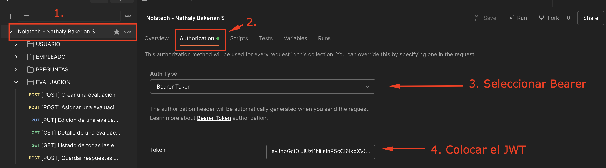
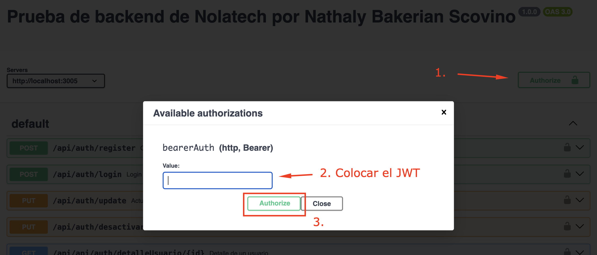

# Nolatech prueba backend - Elaborada por Nathaly Bakerian Scovino

Desarrollar el backend de una API RESTful para un sistema de evaluación 360 grados de empleados remotos en una empresa de desarrollo de aplicaciones.

##### NOTA

En todo proyecto las .env no se suben al repositorio... en este caso se subieron las que se necesitan exactamente para evitar problemas a la hora de levantar el proyecto.

A su vez en la base del proyecto, al mismo nivel de src, esta la colleccion de Postman con todas las rutas que tambien encontraran en el Swagger

## Swagger

Para poder acceder a la documentacion Swagger se debe entrar a traves de esta URL una vez el proyecto 
este levantado:

    - http://localhost:3005/api-docs/

## Features

- CRUD de usuarios
- CRUD de empleados
- CRUD de preguntas
- CRUD de evaluaciones
- Envio de correo al empleado al momento de asignar una nueva evaluacion para su respuesta
- Actualización de las evaluaciones del empleado cuando se esta guardando los datos de una evaluación que tenia pendiente

## Tech Stack

- Node
- Express
- Javascript
- Mongoose/MongoDB
- Docker
- Swager

## Getting Started

El proyecto esta dockerizado para su facil escalamiento e instalación en distintas maquinas. Por lo que 
su unico requisiro es tener instalado y corriendo "Docker" y "npm" para poder levantar el proyecto

1. Clonar el repositorio:

   git clone https://github.com/bakerianathaly/PruebaNolatech.git

2. Instalar dependendias:  

   npm install
   
3. Levantar el proyecto en modo DEV:

   docker-compose -f docker-compose.local.yml up --build

4. El proyecto se levantara en el puerto 3005: 

    http://localhost:3005

# Flujo recomendado para probar

1. Crear un usuario: api/auth/register

2. Login del usuario, para obtener el JWT: api/auth/login

Tanto en el swagger como en la coleccion de postman, estas dos rutas estan libres del middleware del JWT para que pueda ser usadas (sobretodo el registro de usuario para poder registrar el primero).

Luego de que se tenga el JWT se tiene que colocar en:

POSTMAN:

SWAGGER

3. Crear un empleado: api/employees/

NOTA: Se recomienda que al momento de crear un empleado se coloque un correo que utilicen, ya que en el endpoint 7 (asignar una evaluacion), se le manda un correo al empleado para que se le notifique que tiene una evaluacion pendiente c:

4. Crear las preguntas: api/questions/

5. Listar las preguntas (ya que se necesitan los ID para crear una evaluacion): api/questions/

6. Crear una evaluacion: api/evaluations/

7. Asignar una evaluacion a un empleado (se necesitan el ID de un empleado y el ID de una evaluacion): api/evaluations/asignar/evaluacion

8. Responder una evaluacion (se necesitan el ID de ese empleado, el ID de la evaluacion que esta respondiendo y el ID de las preguntas de esa evaluacion ya que cada una lleva su valor): api/evaluations/{id evaluacion}/submit

# Explicación de la estructura del proyecto y decisiones de diseño

Este proyecto ha sido estructurado de forma modular para facilitar la mantenibilidad, escalabilidad y comprensibilidad del código. A continuación, se detalla la función de cada directorio:

/src
    Raíz del proyecto: Contiene todo el código fuente necesario para la aplicación.

/config:
    Almacena los archivos de configuración del proyecto, como conexiones a bases de datos, y otras configuraciones personalizables como el Swagger.

/controllers:
    Contiene los controladores, que son responsables de manejar las solicitudes HTTP entrantes, interactuar con los modelos y devolver las respuestas. Esta separación de responsabilidades mejora la organización del código y facilita las pruebas.

/middlewares:
    Todas las funciones que se ejecutan antes y después de las rutas. Se utilizan para tareas como autenticación, autorización, validación de datos, etc.

/models:
    Carpeta con los modelos o schemas de mongo

/routes:
    Contiene las rutas de la aplicación y asocian las rutas a los controladores correspondientes.

/utils:
    Almacena funciones y utilidades que son utilizadas en diferentes partes del proyecto, como una funcion para 
    el envio de correos o unos enumerados que se llaman en distintas partes del codigo.
